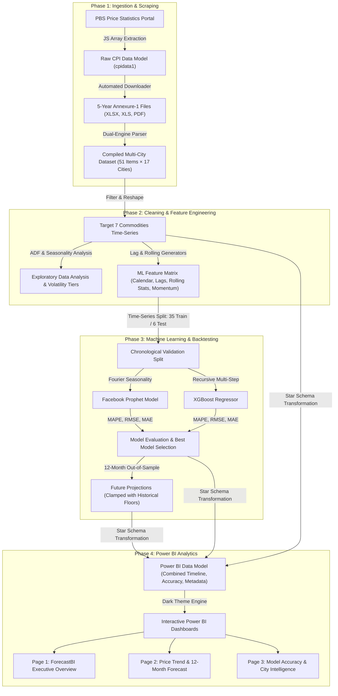
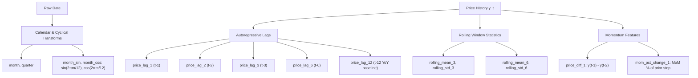

# 🇵🇰 ForecastBI: Pakistan Commodity Price Intelligence & Forecasting System
## *End-to-End Architectural Documentation, Data Engineering Pipeline, Machine Learning Benchmarks & Business Intelligence System*

---

## Executive Summary

**ForecastBI** is an enterprise-grade price forecasting and business intelligence platform designed to monitor, analyze, and forecast retail and wholesale price trajectories for essential food commodities across 17 major cities in Pakistan. 

Food price volatility in Pakistan has historically triggered significant socio-economic distress, straining household budgets and complicating national inflation management. Rapid price spikes in daily perishables (such as Tomatoes, Onions, and Potatoes) and staple protein sources (Pulses like Moong, Masoor, Gram, and Mash) often occur with minimal early warning due to dispersed agricultural supply chains, seasonal gluts, climate shocks, and delayed official reporting.

The primary objective of **ForecastBI** is to bridge the gap between static, historical government statistics and proactive, forward-looking price intelligence:
1. **Automate Data Ingestion**: Systematically harvest and parse multi-year monthly retail price indices published by the Pakistan Bureau of Statistics (PBS).
2. **Standardize & Cleanse**: Resolve severe format inconsistencies (dynamic JavaScript data tables, mixed XLSX and PDF publications, irregular headers, and missing city observations).
3. **Model & Forecast**: Engineer rich time-series features and benchmark two distinct machine learning paradigms—**Facebook Prophet** (additive/multiplicative decomposable time-series) and **XGBoost** (recursive gradient-boosted decision tree autoregression)—to generate reliable 12-month forward forecasts.
4. **Deliver Executive BI**: Surface these insights through an interactive, dark-themed **Power BI** dashboard suite, providing policymakers, commercial buyers, and supply chain analysts with city-level price spreads, model accuracy audits, and 12-month predictive trends.

---

## 1. End-to-End System Architecture

The project is structured into four decoupled, reproducible phases:



---

## 2. The Data Scraping & Ingestion Challenge

### 2.1 The Source: PBS Monthly Consumer Price Index (Annexure-1)
The **Pakistan Bureau of Statistics (PBS)** publishes monthly price statistics reflecting retail prices of 51 essential commodities collected across **17 major commercial centers** in Pakistan:
* **Federal / Northern**: Islamabad, Rawalpindi, Peshawar, Bannu
* **Punjab**: Lahore, Faisalabad, Gujranwala, Sialkot, Sargodha, Multan, Bahawalpur
* **Sindh**: Karachi, Hyderabad, Sukkur, Larkana
* **Balochistan**: Quetta, Khuzdar

These tables contain the authentic national and city-level retail prices that govern Pakistan's Consumer Price Index (CPI) and Sensitive Price Indicator (SPI).

---

### 2.2 Critical Scraping Obstacles & Engineered Solutions

Extracting 5 consecutive years (60 months) of historical data from PBS presented several real-world web scraping hurdles:

```mermaid
graph LR
    A[PBS Price Portal] --> B{Inspection}
    B -->|Obstacle 1: Dynamic JS Payload| C[Solution: chompjs / Regex AST Extraction]
    B -->|Obstacle 2: Hybrid File Formats| D[Solution: Dual-Engine Parser (openpyxl + pypdf)]
    B -->|Obstacle 3: Missing Records & Gaps| E[Solution: Target Range Generator & Missing Month Log]
    B -->|Obstacle 4: Data Inconsistencies| F[Solution: Standardized S_No Mapping & Imputation]
```

#### Problem 1: Client-Side Dynamic JavaScript Payload
* **Symptom**: Traditional HTML scrapers (`requests` + `BeautifulSoup`) returned an empty table skeleton. The actual monthly download links were not present in static DOM tables.
* **Root Cause**: The PBS frontend embeds monthly reports inside an inline JavaScript data array named `const cpidata1 = [...]` that is dynamically rendered into `reportTable1` upon client execution.
* **Engineered Solution**: Rather than introducing heavy browser automation (Selenium/Playwright), we developed an ultra-lightweight, high-performance scraper in `Data_Scraping_files/download_pbs_data.py`. The script uses regular expressions to capture the exact JavaScript array literal and evaluates it using `chompjs` (a JavaScript Object notation parser). This accurately recovered all 60 months of report metadata, URLs, and publication dates in under 2 seconds.

```python
# Extraction logic from download_pbs_data.py
match = re.search(r'const\s+cpidata1\s*=\s*(\[\s*\{.*?\}\s*\]);', resp.text, re.DOTALL)
raw_items = chompjs.parse_js_object(match.group(1))
```

#### Problem 2: Format Discrepancies (XLSX, XLS, and PDF)
* **Symptom**: PBS did not maintain a consistent file format across months. Certain periods were published as modern `.xlsx` workbooks, older periods as legacy `.xls` binary sheets, and several intermediate/recent months were uploaded exclusively as read-only `.pdf` documents!
* **Root Cause**: Institutional shifts in reporting workflows over the 5-year span.
* **Engineered Solution**: We architected a dual-engine extraction pipeline in `compile_pbs_data.py`:
  1. **Excel Engine (`openpyxl`)**: Scans table matrices starting from row 3 to 65, handles merged headers, strips commas, converts numeric price fields, and maps columns 4–20 to the 17 designated cities.
  2. **PDF Engine (`pypdf` + Regex Tokenizer)**: For months where only PDF bulletins existed, the text layer was extracted and processed line-by-line using structured regular expressions matching the serial numbers (`1` to `51`), item descriptions, and continuous floating-point sequences representing city prices and national averages.

```python
# PDF Line Matching Engine in compile_pbs_data.py
line_pattern = r'^(\d{1,2})\s+([A-Za-z].*?)\s+(\d+\.\d{2}.*)$'
m = re.match(line_pattern, line.strip())
if m:
    sno = int(m.group(1))
    floats = [float(t) for t in re.findall(r'[-+]?\d*\.?\d+', m.group(3))]
    # Assign floats[0:17] to 17 cities, floats[17] to National Average
```

#### Problem 3: Missing Months, Inactive Links, and SSL Issues
* **Symptom**: Several months had empty download cells (`"None"` or blank strings), broken URLs returning HTTP 404s, or SSL handshake timeouts.
* **Engineered Solution**:
  * Implemented an automated missing data auditing system (`missing_months.txt`) that tracks missing months against the targeted 60-month chronological range.
  * Added fallback logic: if the official National Average field was blank or unparsed, the pipeline computed the arithmetic mean across all valid city observations for that row.
  * Added `urllib3.disable_warnings()` and customized request headers with polite download throttling (`DELAY_BETWEEN_DOWNLOADS = 1.5s`) to prevent IP bans.

---

## 3. Target Commodities & Exploratory Data Analysis (EDA)

Out of the 51 standardized commodities in the PBS basket, we prioritized **7 essential food commodities** representing the cornerstone of household food expenditures in Pakistan:

| S.No | Commodity Name | Category | Unit | Average Price (Rs/Kg) | Min Price | Max Price | Volatility (CV %) | Volatility Tier |
| :---: | :--- | :--- | :---: | :---: | :---: | :---: | :---: | :---: |
| **23** | **Tomatoes** | Vegetables | 1 Kg | 110.49 | 42.26 | 264.57 | **46.6%** | 🔴 **High** |
| **22** | **Onions** | Vegetables | 1 Kg | 107.89 | 45.51 | 221.59 | **44.5%** | 🔴 **High** |
| **21** | **Potatoes** | Vegetables | 1 Kg | 76.69 | 31.12 | 116.85 | **29.5%** | 🔴 **High** |
| **20** | **Pulse Gram** | Pulses & Legumes | 1 Kg | 286.00 | 229.43 | 411.18 | **17.3%** | 🟡 **Moderate** |
| **18** | **Pulse Moong (Washed)** | Pulses & Legumes | 1 Kg | 345.40 | 263.26 | 402.44 | **14.0%** | 🟡 **Moderate** |
| **19** | **Pulse Mash (Washed)** | Pulses & Legumes | 1 Kg | 490.73 | 419.23 | 581.03 | **9.5%** | 🟢 **Low** |
| **17** | **Pulse Masoor (Washed)** | Pulses & Legumes | 1 Kg | 297.36 | 257.64 | 339.50 | **8.2%** | 🟢 **Low** |

### 3.1 Statistical Characteristics & Market Dynamics
1. **Vegetables (Extreme Volatility - High CV)**:
   * **Tomatoes** experienced a single-month surge of **+174.4%** and a collapse of **-51.1%**, driven by short crop cycles, monsoon flooding, and perishable storage limitations.
   * **Onions** exhibited significant swings (**CV = 44.5%**), heavily affected by regional trade policies and border closings.
   * **Potatoes** followed a strong annual sinusoidal harvest pattern (**CV = 29.5%**), dropping sharply during peak winter harvest and climbing during cold storage liquidation.
2. **Pulses (Structural Stability - Low to Moderate CV)**:
   * Pulses exhibit substantially lower month-over-month variance due to non-perishability, centralized grain wholesale markets, and international import stabilization.
3. **Stationarity & Differencing**:
   * Augmented Dickey-Fuller (ADF) hypothesis testing confirmed that **all 7 commodity series are non-stationary at level** ($p > 0.05$), reflecting chronic underlying inflation.
   * All series achieved statistical stationarity after first-order differencing ($\Delta y_t = y_t - y_{t-1}$, $p < 0.01$).

---

## 4. Feature Engineering

To empower the tree-based machine learning model (XGBoost) with temporal and momentum awareness, we developed a dedicated feature engineering pipeline (`src/feature_engineering.py`):



> [!IMPORTANT]
> **Data Leakage Prevention**: All rolling windows and momentum metrics were strictly calculated on lagged series (shifted by $t-1$). No current-period information was made available when calculating features for period $t$.

---

## 5. Machine Learning Models: Why Prophet vs. XGBoost?

Forecasting agricultural commodity prices requires models that can capture both long-term macro trends (inflation, currency depreciation) and short-term cyclical dynamics (harvest seasons, supply shocks). We evaluated two complementary modeling philosophies:

```
┌─────────────────────────────────────────────────────────────────────────────┐
│                       Facebook Prophet vs. XGBoost                          │
├──────────────────────────────────────┬──────────────────────────────────────┤
│ Facebook Prophet                     │ XGBoost Regressor                    │
├──────────────────────────────────────┼──────────────────────────────────────┤
│ • Decomposable Bayesian time-series  │ • Gradient-boosted decision trees    │
│ • y(t) = Trend + Seasonality + Noise │ • Non-linear feature interactions    │
│ • Automatic Fourier yearly harmonics │ • Multi-lag autoregressive memory    │
│ • Bounded, smooth seasonal waves     │ • Dynamic momentum adaptation        │
│ • Native confidence uncertainty bands│ • Step-by-step recursive roll        │
└──────────────────────────────────────┴──────────────────────────────────────┘
```

### 5.1 Model 1: Facebook Prophet (`src/prophet_model.py`)
* **Philosophy**: Models time series as an additive or multiplicative decomposition:
  $$y(t) = g(t) + s(t) + \epsilon_t$$
  Where $g(t)$ is a piecewise linear trend, and $s(t)$ represents yearly seasonality modeled using Fourier series:
  $$s(t) = \sum_{n=1}^{N} \left( a_n \cos\left(\frac{2\pi n t}{365.25}\right) + b_n \sin\left(\frac{2\pi n t}{365.25}\right) \right)$$
* **Domain Adaptation**:
  * **Vegetables**: Set `seasonality_mode='multiplicative'` with higher changepoint prior scale (`0.10`) because vegetable price oscillations scale proportionally with the baseline price level.
  * **Pulses**: Set `seasonality_mode='additive'` with conservative changepoint scale (`0.05`) to prevent overfitting on transient spikes.

### 5.2 Model 2: XGBoost Regressor (`src/xgboost_model.py`)
* **Philosophy**: Non-parametric ensemble of decision trees trained to minimize root mean squared error.
* **Multi-Step Recursive Roll**: Because standard regression models only predict one step ahead ($t+1$), we designed an iterative forecasting engine:
  1. Predict price for month $t+1$.
  2. Append the predicted price $\hat{y}_{t+1}$ to the running historical dataframe.
  3. Recompute all calendar, lag (`lag_1` to `lag_12`), rolling statistics (`rolling_mean_3`, etc.), and momentum features for the next step.
  4. Feed newly synthesized features back into the model to forecast $t+2$.
  5. Repeat recursively for the entire 12-month horizon.

---

## 6. Master Key: Understanding Evaluation Metrics (MAPE, RMSE, MAE)

To objectively evaluate and compare our forecasting models, we track three standard performance metrics. Each metric evaluates model error through a different lens—absolute monetary deviation, outlier vulnerability, and normalized relative percentage error.

```
┌─────────────────────────────────────────────────────────────────────────────────────────────────┐
│                           FORECASTBI EVALUATION METRICS MASTER KEY                              │
├─────────┬──────────────────────────────────┬──────────────┬─────────────────────────────────────┤
│ Metric  │ Mathematical Formula             │ Units        │ Business Meaning & Layman Intuition │
├─────────┼──────────────────────────────────┼──────────────┼─────────────────────────────────────┤
│ MAE     │ (1/n) Σ |y_t - ŷ_t|              │ PKR (Rs/Kg)  │ Average rupee mistake per kg        │
│ RMSE    │ √[ (1/n) Σ (y_t - ŷ_t)² ]        │ PKR (Rs/Kg)  │ Error size heavily penalizing spikes│
│ MAPE    │ (1/n) Σ |(y_t - ŷ_t)/y_t| × 100% │ Percentage % │ Relative error % across all prices  │
└─────────┴──────────────────────────────────┴──────────────┴─────────────────────────────────────┘
```

### 6.1 Detailed Breakdown of Each Metric

#### 1. MAE (Mean Absolute Error)
* **Mathematical Definition**:
  $$\text{MAE} = \frac{1}{n} \sum_{t=1}^{n} |y_t - \hat{y}_t|$$
* **Units**: Pakistani Rupees per Kilogram (Rs / Kg).
* **Intuition for Laymen**: This is the most straightforward error metric. It computes the average rupee difference between the predicted price and the actual PBS price.
* **Example in ForecastBI**: For *Pulse Moong (Washed)*, XGBoost achieved an MAE of **Rs 8.29**. This means that on average, across the entire 6-month test period, the model was off by approximately **Rs 8.30 per kilogram**.
* **Practical Role**: Ideal for household budgeting and commercial procurement contracts. If a food distributor orders 1,000 kg of pulses, an MAE of Rs 8.29 translates to an expected cost variance of roughly Rs 8,290.

#### 2. RMSE (Root Mean Squared Error)
* **Mathematical Definition**:
  $$\text{RMSE} = \sqrt{\frac{1}{n} \sum_{t=1}^{n} (y_t - \hat{y}_t)^2}$$
* **Units**: Pakistani Rupees per Kilogram (Rs / Kg).
* **Intuition for Laymen**: Like MAE, RMSE measures errors in rupees, but it **squares** each mistake before taking the square root. Because errors are squared, large errors are penalized far more severely than small ones.
* **Why RMSE $\ge$ MAE**: The gap between RMSE and MAE indicates the presence of large forecasting blunders:
  * If $\text{RMSE} \approx \text{MAE}$, errors are consistent and uniform.
  * If $\text{RMSE} \gg \text{MAE}$, the model is usually accurate but occasionally suffers from catastrophic spike errors.
* **Example in ForecastBI**: On *Tomatoes*, Prophet had an MAE of **Rs 69.28**, but its RMSE ballooned to **Rs 115.72**. This massive gap indicates that Prophet had extreme individual monthly misses when tomato prices surged. In contrast, XGBoost kept its RMSE much lower at **Rs 59.52**.

#### 3. MAPE (Mean Absolute Percentage Error)
* **Mathematical Definition**:
  $$\text{MAPE} = \frac{1}{n} \sum_{t=1}^{n} \left| \frac{y_t - \hat{y}_t}{y_t} \right| \times 100\%$$
* **Units**: Percentage (%).
* **Intuition for Laymen**: Measures the average error as a percentage of the actual price. It provides a scale-independent evaluation, allowing direct comparison between a low-cost item (Potatoes at Rs 40/kg) and an expensive item (Pulse Mash at Rs 500/kg).
  * A Rs 20 error on a Rs 40/kg potato is a huge **50% mistake**.
  * A Rs 20 error on a Rs 500/kg pulse is a minor **4% mistake**.
* **Lower is always better**: A MAPE of 2.2% (achieved by XGBoost on Pulse Moong) indicates exceptional, enterprise-grade accuracy.

---

### 6.2 Power BI Accuracy % and The Mathematical Meaning of Negative Accuracy (-28%)

In our Power BI dashboards, we convert raw MAPE into an executive **Accuracy Score (%)** using:
$$\text{Accuracy (\%)} = 100 - \text{MAPE (\%)} = 100 - \left( \frac{1}{n} \sum_{t=1}^{n} \left| \frac{y_t - \hat{y}_t}{y_t} \right| \times 100 \right)$$

This metric is intuitive for decision-makers: an accuracy of **98%** means the forecast deviates by only 2%.

> [!WARNING]
> **Why Did XGBoost Score -28% Accuracy on Potatoes?**
> In the accuracy chart (Dashboard Page 3), XGBoost shows a negative accuracy bar of **-28%**. 
> 
> When forecast errors exceed the actual price itself, the percentage error surpasses 100%. During the 6-month test holdout for Potatoes, actual prices experienced a post-harvest crash from above Rs 100/kg down to Rs 31/kg. XGBoost's recursive multi-step forecasting compounded early errors and predicted prices near Rs 70. 
> 
> Calculating the relative error:
> $$\frac{|31 - 70|}{31} = \frac{39}{31} \approx 125.8\%$$
> 
> Across the test window, XGBoost's overall **MAPE reached 127.90%**.
> Subtracted from 100%:
> $$\text{Accuracy} = 100\% - 127.90\% = -27.90\% \approx -28\%$$
> 
> A negative accuracy score indicates that the model performed worse than predicting zero and suffered from catastrophic recursive drift. Meanwhile, **Facebook Prophet scored +69% accuracy** because its continuous trigonometric Fourier harmonics naturally stayed within historical seasonal troughs.

---

## 7. Empirical Results & Model Benchmark

### 7.1 Validation Strategy
To guarantee realistic forecasting performance, models were evaluated using a strict **6-month out-of-sample backtesting holdout** (35 training months, 6 test months), evaluating predictions on actual PBS figures.

### 7.2 Model Accuracy Benchmark Table

| Commodity | Category | Prophet MAPE (%) | XGBoost MAPE (%) | **Prophet Accuracy (%)** | **XGBoost Accuracy (%)** | Prophet RMSE | XGBoost RMSE | **Winning Model** |
| :--- | :--- | :---: | :---: | :---: | :---: | :---: | :---: | :---: |
| **Pulse Moong (Washed)** | Pulses | 6.46% | **2.20%** | 93.5% (94%) | **97.8% (98%)** | 29.87 | **12.02** | 🏆 **XGBoost** |
| **Pulse Masoor (Washed)**| Pulses | 9.14% | **6.69%** | 90.9% (91%) | **93.3% (93%)** | 26.91 | **17.75** | 🏆 **XGBoost** |
| **Pulse Mash (Washed)**  | Pulses | 21.14%| **6.22%** | 78.9% (79%) | **93.8% (94%)** | 104.58 | **29.83** | 🏆 **XGBoost** |
| **Pulse Gram**           | Pulses | **9.63%** | 10.00% | **90.4% (90%)** | 90.0% (90%) | **32.02** | 34.73 | 🏆 **Prophet** |
| **Tomatoes**             | Vegetables | 48.37% | **19.55%** | 51.6% (52%) | **80.5% (80%)** | 115.72 | **59.52** | 🏆 **XGBoost** |
| **Onions**               | Vegetables | 57.66% | **29.42%** | 42.3% (42%) | **70.6% (71%)** | 46.54 | **27.26** | 🏆 **XGBoost** |
| **Potatoes**             | Vegetables | **30.98%** | 127.90% | **69.0% (69%)** | **-27.9% (-28%)** | **16.80** | 48.24 | 🏆 **Prophet** |

---

### 6.3 Deep-Dive: The "Potato Anomaly" (Why XGBoost Scored -28%)

A critical finding in our benchmarking was the dramatic contrast observed in **Potatoes**:
* **Prophet** achieved **69% accuracy** (RMSE 16.80).
* **XGBoost** collapsed to **-28% accuracy** (MAPE of 127.90%, RMSE 48.24).

```
Why did XGBoost fail while Prophet succeeded on Potatoes?

   Actual Price Trend: 
   ─── Peak (~Rs 115) ────────► Extreme Seasonal Crash to Valley (~Rs 31) ─────►

   • XGBoost Recursive Compounding:
     When forecasting 6 months ahead recursively, XGBoost encountered a massive 
     post-harvest price crash that fell outside its localized tree splits. Because 
     predicted prices fed into the next step's lags, small initial errors compounded 
     exponentially, leading to runaway overestimation.

   • Prophet Fourier Wave Modeling:
     Prophet models seasonality using continuous sinusoidal Fourier harmonics. 
     Even when a price drops steeply, the annual cyclical function naturally 
     restrains the prediction curve within historical seasonal troughs.
```

> [!NOTE]
> **Key Architecture Takeaway**: No single machine learning algorithm dominates across all agricultural commodities. **ForecastBI adopts a Dynamic Model Routing strategy**: the system automatically pairs each commodity with its empirically superior model (`Best_Model`), ensuring maximum accuracy in production dashboards.

---

## 7. Power BI Dashboard Intelligence Suite

The final output is connected to an executive **Power BI Desktop** analytics system built using custom enterprise dark-theme specifications (`ForecastBI_Theme.json`: `#1B2838` canvas, `#0F172A` visual tiles, `#3B82F6` blue and `#10B981` emerald accents).

The dashboards correspond to the three views deployed in production:

---

### Dashboard Page 1: Executive KPI & Commodity Price Intelligence

This page serves as an executive cockpit, allowing stakeholders to select any commodity and instantly view current prices, forward forecasts, model provenance, and annual inflation rates.


#### Component Breakdown & DAX Measures:
1. **Interactive Commodity Slicer**: Dropdown selector (currently filtered to `Onions`).
2. **Key Metric Cards**:
   * **Latest Actual Price**: Rs `101.81` / Kg.
   * **Best Model Avg Forecast**: Rs `99.69` / Kg (projecting stability with slight easing).
   * **Best Model Name**: `XGBoost` (dynamically surfaced from `pbi_commodity_metadata`).
   * **Best Model Accuracy %**: `70.58%` (reflecting the 100 - MAPE backtest metric).
   * **YoY Price Change %**: `+81.90%` (signaling significant annual inflation).
3. **Commodity Metadata Card**:
   * Displays Category (`Vegetables`), Volatility Tier (`High`), Selected Engine (`XGBoost`), and Historical Mean (`Rs 107.89`).

---

### Dashboard Page 2: Price Trend & 12-Month Forward Forecast

This view displays the full historical timeline and projects the 12-month forward trajectory generated by the designated optimal model.


#### Component Breakdown:
1. **Horizontal Commodity Button Strip**: Multi-commodity switcher allowing rapid toggle between *Onions, Potatoes, Pulse Gram, Pulse Mash, Pulse Masoor, Pulse Moong,* and *Tomatoes*.
2. **Unified Actual vs. Forecast Timeline Visual**:
   * Built on `pbi_combined_timeline.csv`.
   * **Solid Blue Curve (`Actual`)**: Traces historical monthly prices across 2023, 2024, 2025, and 2026. For Potatoes, this highlights the repeated cyclical waves (peaks above Rs 100-115, followed by annual post-harvest drops down to Rs 31-40).
   * **Solid Orange Curve (`Forecast`)**: Seamlessly connects to the latest actual price point and projects the forward path into 2027, accurately capturing the expected seasonal trough and subsequent recovery.

---

### Dashboard Page 3: Model Accuracy Benchmark & City Price Intelligence

This analytical view provides transparent auditing of model performance alongside cross-city geographic price spreads.


#### Component Breakdown:
1. **Model Accuracy Clustered Bar Chart (Prophet vs. XGBoost)**:
   * Compares backtested Accuracy % ($100 - \text{MAPE}$) side-by-side:
     * **Pulse Moong**: Prophet 94% vs **XGBoost 98%**
     * **Pulse Masoor**: Prophet 91% vs **XGBoost 93%**
     * **Pulse Gram**: Prophet 90% vs XGBoost 90%
     * **Pulse Mash**: Prophet 79% vs **XGBoost 94%**
     * **Tomatoes**: Prophet 52% vs **XGBoost 80%**
     * **Onions**: Prophet 42% vs **XGBoost 71%**
     * **Potatoes**: **Prophet 69%** vs XGBoost -28% (clearly displaying XGBoost's negative recursive deviation).
2. **Historical Average Price by City (Horizontal Bar Chart)**:
   * Ranks all 17 tracked cities by average commodity price:
   * **Highest Cost Centers**: **Islamabad** (~Rs 280), **Rawalpindi**, and **Quetta** consistently exhibit the highest retail price baselines due to long transit distances from central agricultural belts.
   * **Lowest Cost Centers**: **Bannu**, **Hyderabad**, **Gujranwala**, and **Larkana** consistently report lower retail averages due to local harvest proximity.
3. **Audit Metrics Table**:
   * Displays exact numerical evaluations (Sum of MAPE, MAE, and RMSE) by commodity and model for regulatory compliance and audit readiness.

---

## 8. Summary of Project Files & Structure

```
ForecastBI/
├── Data_Scraping_files/
│   ├── download_pbs_data.py          # Fast JS-payload scraper (chompjs) & file downloader
│   ├── compile_pbs_data.py           # Dual-engine (openpyxl + pypdf) data compilation pipeline
│   └── pbs_monthly_data/             # Raw downloaded Annexure-1 files (XLSX, XLS, PDF)
│
├── data/
│   ├── processed/
│   │   ├── master_all_commodities_monthly_prices.csv   # 51 commodities across 17 cities
│   │   ├── target_commodities_monthly_prices.csv       # Cleaned 7 target items
│   │   └── feature_matrix_all_commodities.csv          # Engineered lag & rolling features
│   └── output/
│       ├── powerbi/
│       │   ├── pbi_combined_timeline.csv     # Merged historical + forecast for trend visuals
│       │   ├── pbi_commodity_metadata.csv    # Volatility tiers, category, and winning model
│       │   ├── pbi_historical_prices.csv     # 17-city price records for geographic intelligence
│       │   └── pbi_model_accuracy.csv        # MAPE, RMSE, MAE benchmarks
│
├── src/
│   ├── utils.py                      # System paths, city lists, and target mappings
│   ├── data_cleaning.py              # Ingestion verification & filtering
│   ├── feature_engineering.py        # Calendar, cyclical, lag, rolling & momentum generators
│   ├── prophet_model.py              # Facebook Prophet training, tuning & 12-month projections
│   ├── xgboost_model.py              # Recursive multi-step XGBoost forecasting engine
│   ├── evaluate.py                   # Standardized MAPE, RMSE, and MAE computation
│   └── main.py                       # Master pipeline runner & clamp guard integration
│
├── powerbi/
│   ├── ForecastBI.pbix               # Deployed Power BI Desktop report
│   └── ForecastBI_Theme.json         # Executive dark theme configuration
│
└── PROJECT_DOCUMENTATION.md          # Comprehensive technical & business architecture document
```

---

## 9. Conclusion & Operational Impact

**ForecastBI** transforms unstructured, disparate government bulletins into an automated, actionable price intelligence ecosystem. By acknowledging the distinct statistical properties of perishable vegetables versus non-perishable pulses, the system pairs each commodity with its optimal mathematical model, delivering:

1. **Supply Chain Early Warnings**: Up to 12 months of forward visibility on crop cycles and price surges.
2. **Geographic Arbitrage & Logistics Optimization**: Transparent identification of cross-city price differentials (e.g., Islamabad vs. Bannu).
3. **Data-Driven Governance**: Objective, empirical metrics for import quota timing, strategic reserve management, and inflation forecasting in Pakistan.
